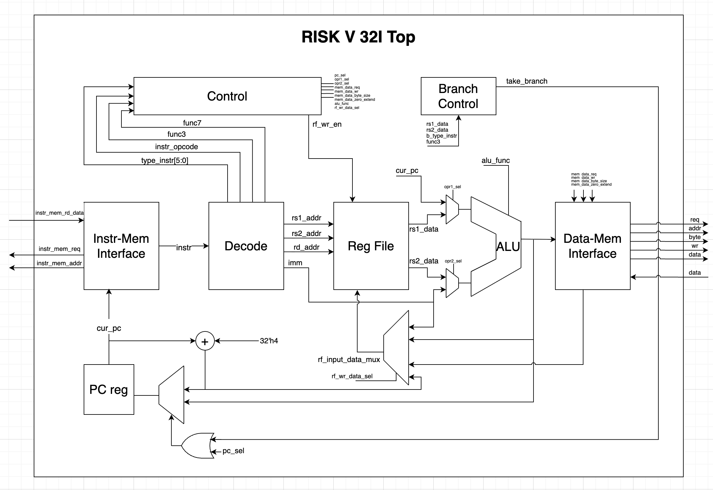

# YARP – RV32I RISC-V Processor (SystemVerilog)

YARP is a **modular RV32I RISC-V processor implementation written in SystemVerilog**. 
The design follows a clean separation between **fetch, decode, execute, register file, control, and memory interfaces**.

This project focuses on:
- Readable RTL architecture
- Clear control/data separation

---

## 🧠 Architecture Overview

The processor implements the **base RV32I instruction set**, including:

- Integer arithmetic & logic
- Control flow (branches & jumps)
- Load/store instructions
- Register-based execution model

### 🔳 Top-Level Block Diagram

